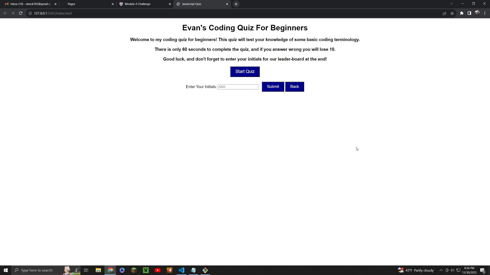
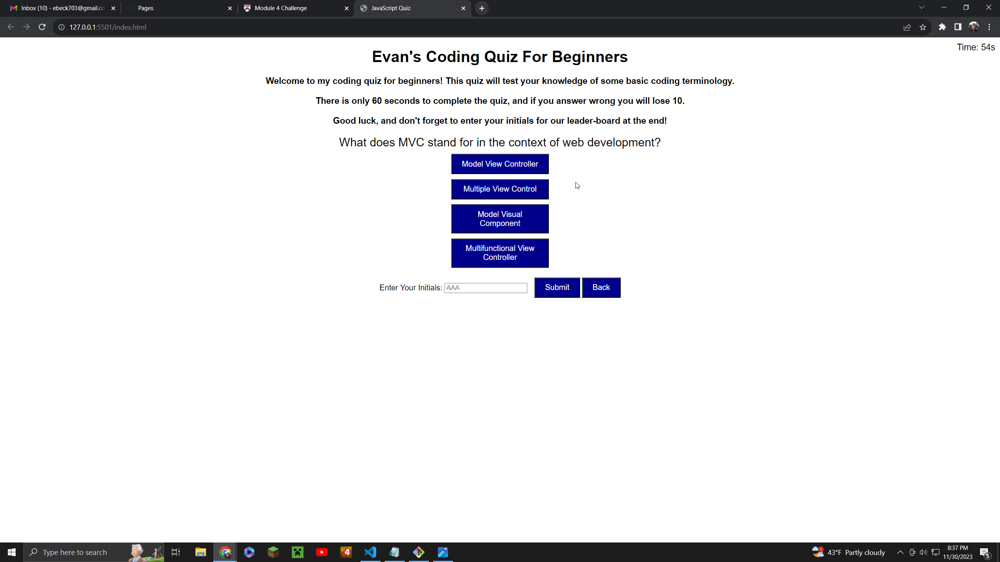
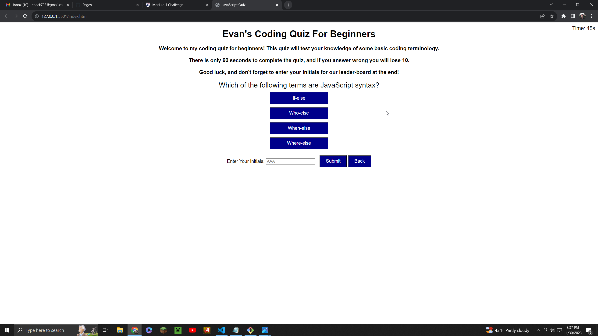
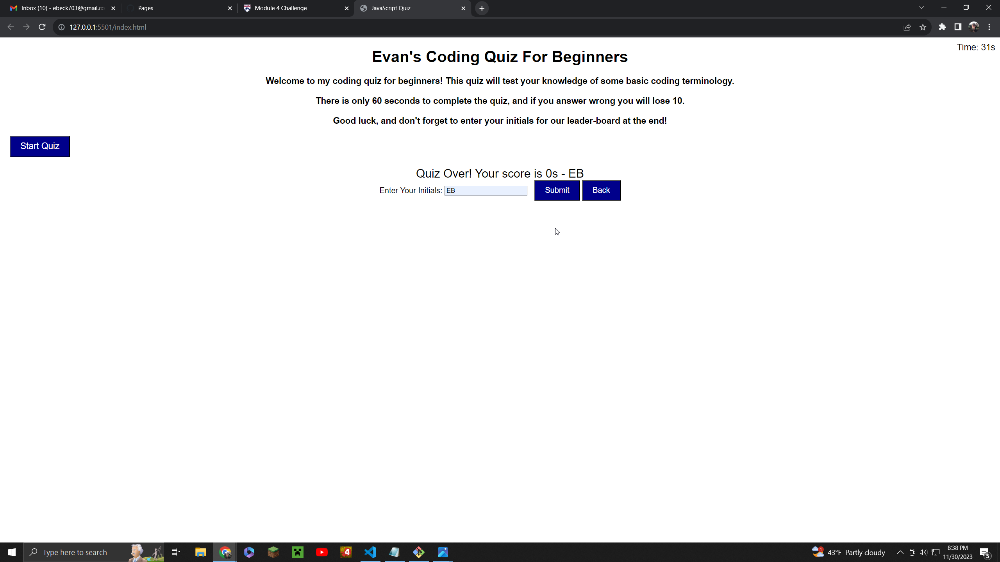

The USER STORY with this project was to create a working Coding quiz that stores high scores so that progress can be gauged compared to peers.

This is done when the acceptance criteria is met which includes - 
A start button to begin the quiz. 
This is followed by a timer that starts counting down and five coding questions. 
When a question is answered, the user is presented with another question, until they reach the end of the quiz. 
If a question is entered incorrectly, ten seconds is subtracted from the quiz. 
When all questions are answered or the timer reaches 0, the quiz ends and the game is over.
When the game ends, the user can enter their initials and score to be saved on the leader-board. 

For my final product, I was unable to make the final score display properly. It displays as "Quiz Over! Your score is 0s - EB." 

The score does change, but it ranges from -10 to -60s, then after submitting it displays a 0. I was unable to figure out this error. 

I also decided to spice it up with the questions, some involving back-end languages, rather than being a strictly JavaScript based quiz. 

I also could not figure out how to make scores save or create a leader-board sadly. 

The final thing that I could not fix was the timer element. When a wrong answer is clicked, nothing happens. No time is lost, and you do not move to the next question. 

I was able to meet the rest of the acceptance criteria, everything else displayed properly. All choice boxes were even, the text was formatted and colored coherently the way I wanted it to be. 

Here is the link to the live server - https://egamer13.github.io/coding-quiz-game/

Here are 4 screenshots of the finished product. 

